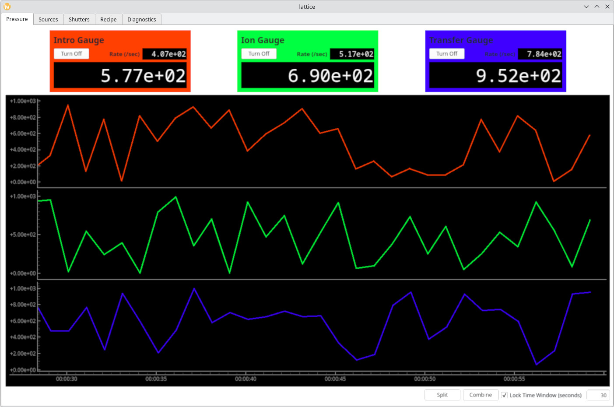

# Overview

Lattice is a visual device control and monitoring tool for use with hardware commonly used in molecular beam epitaxy (MBE) systems.

## Features
- Live monitoring and control of pressure gauges, thermal PID controllers, and motors
- Recipe creation tool: Program changes to device parameters with delays, loops, and conditionals
- Pop out tabs to separate windows for more convenient viewing with more screen space